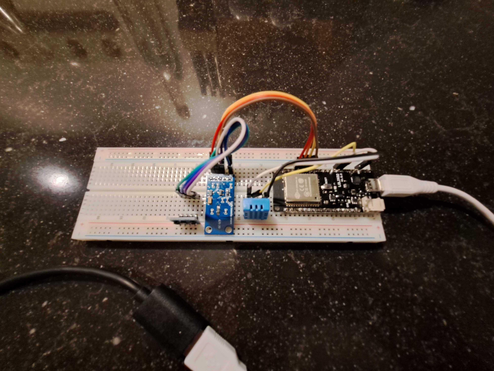
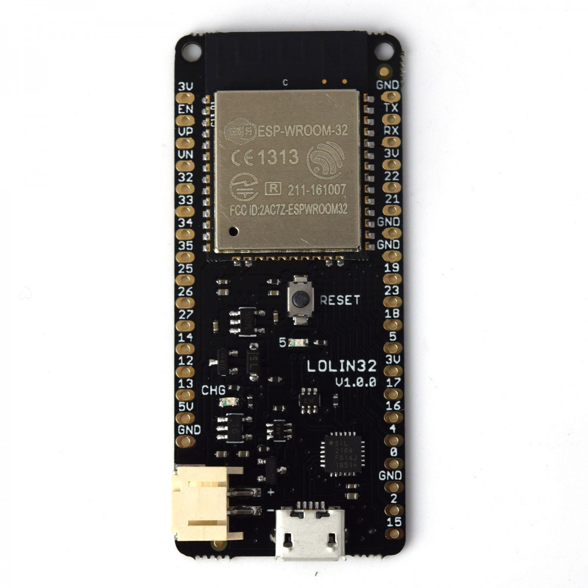
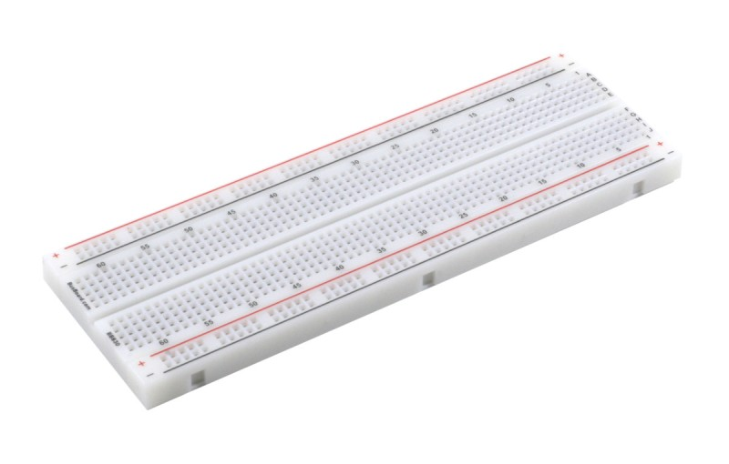
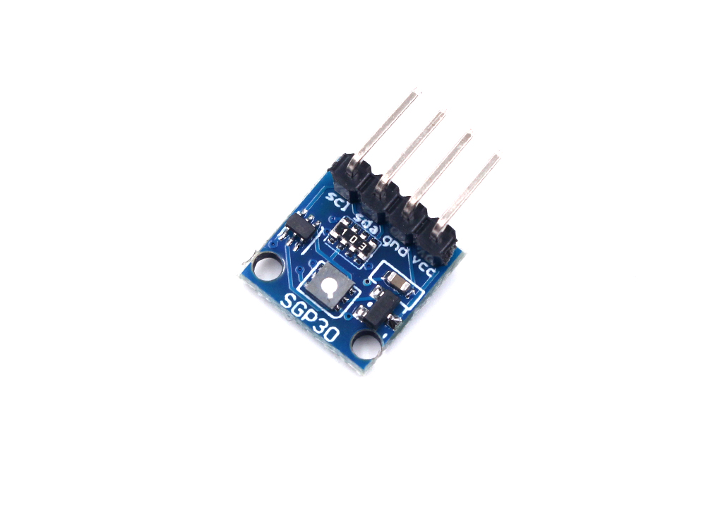
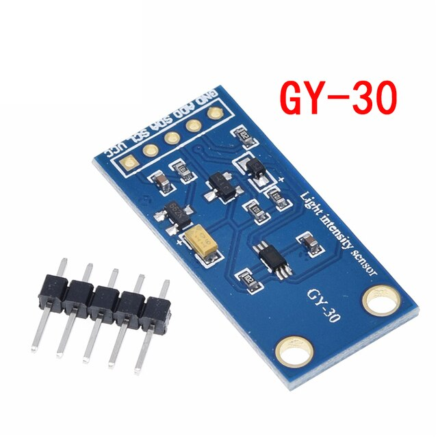
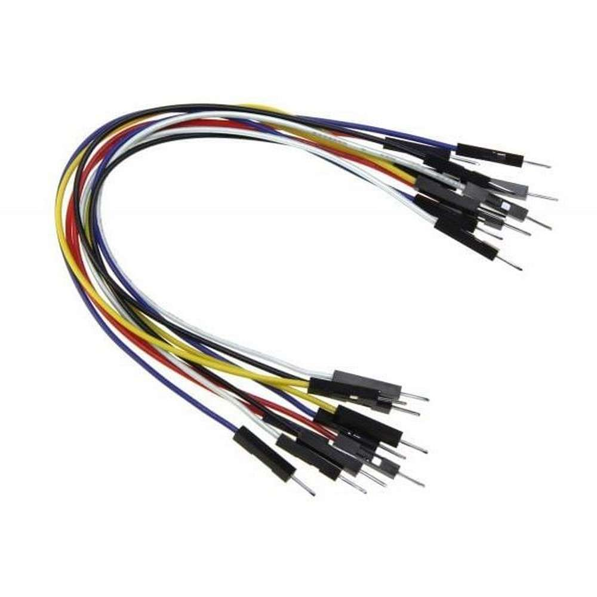
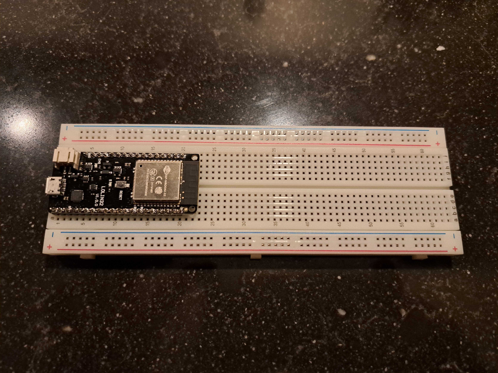
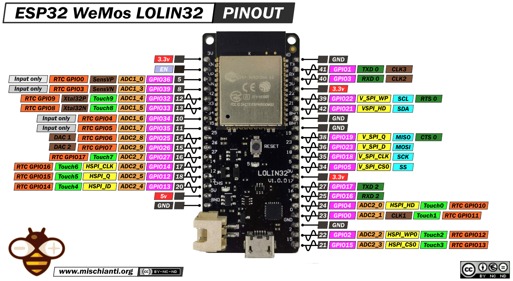
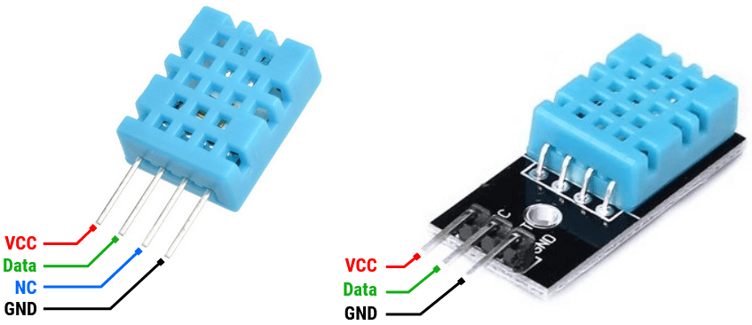

# Integrate your own sensors using ESPHome

In this workshop we are going to connect sensors into ESPHome. We are going to do this in four teams. Each tem has a kit with with electronic components that will be combined to a sensor unit.
The sensor unit will be integrated into a local Home-Assistant instance using ESPHome.

  


## Sensor kit

The sensor kit contains the following components:

-  LOLIN32 NodeMCU
This is a microcontroller from Expressif containing the ESP32 MCU that can connect to Bluetooth and WiFi. For this workshop we will only use WiFi connectivity.

-  Breadboard
A breadboard, solderless breadboard, protoboard, or terminal array board is a construction base used to build semi-permanent prototypes of electronic circuits. Unlike stripboard (Veroboard), breadboards do not require soldering or destruction to tracks and are hence reusable.

-  SGP30
This is a gas sensor that can detect a wide range of Volatile Organic Compounds (VOCs) and H2 and is intended for indoor air quality monitoring. When connected to your microcontroller (running our library code) it will return a Total Volatile Organic Compound (TVOC) reading and an equivalent carbon dioxide reading (eCO2) over I2C.

-  GY-30 aka BH1750
The BH1750 is a digital Ambient Light intensity Sensor IC for I2 C bus interface, and this kind of IC can adjust the background light of LCD and keyboard according to the intensity data of the collected light. It is possible to detect a wide range of changes of light intensity with high resolution.

-  Jumper wires
A set of jumper wires to connect the components on the breadboard.

## Configure your computer.

These steps will prepare your computer to deploy the sensor board and integrate into Home-Asssistant.

### Home-Assistant

For this workshop we are going to deploy a local HomeAssistant instance using Docker.
A docker-compose has been prepared to deploy this docker. Open a terminal and run the following command:

```shell
docker-compose up
```

This should create a local Home-Assistant instance which should be accessible in your browser using the following url:

- [http://localhost:8123](http://localhost:8123)

The login credentials are:

- User: `GDD`
- Pass: `XKE_2022906!`

## Python + ESPHome

ESPHome is a system to control your ESP8266/ESP32 by simple yet powerful configuration files and control them remotely through Home Automation systems.
It allows to define your sensor-board in terms of a yaml file and will generate and upload code to the LOLIN32 board.

### Python

Make sure you have a python 3 environment up and running before installing ESPHome. If not create one using virtualenv or conda.

### Installing ESPHome

To install ESPHome run the following command in your Python environment:

```shell
pip install wheel esphome
```

When properly installed the following command should return the installed esphome version:

```shell
esphome version
```

You should see something like this:

```shell
Version: 2022.8.1
```

Now you are ready to configure the sensor board.

## Create ESPHome config
The esphome tool has a nice wizard to create a configuration file.
To create a config called office.yml type the following in your terminal:

```shell
esphome wizard office.yml
```

This will start the esphome wizard. You will be asked the following input:

1. Name: This is your node name. You could type `office` for instance.
2. Please enter either ESP32 or ESP8266: You should type `ESP32` here.
3. Enter board type: The board we are using is `lolin32`
4. SSID: Enter here the Xebia office wifi ssid
5. PSK: Enter the Xebia WiFi password here
6. OTA password: please enter a password you can remember.You will need this password if you would like to reprogram your sensor board over the air via WiFi. This is also the password you will need to enter when adding the board to Home-Assistant.

Now you should be done creating the office.yml file. The file should look like this:
```yaml
esphome:
  name: <your node name here>

esp32:
  board: lolin32
  framework:
    type: arduino

# Enable logging
logger:

# Enable Home Assistant API
api:
  password: <your ota password>

ota:
  password: <your ota password>

wifi:
  ssid: <SSID>
  password: <PSK>

  # Enable fallback hotspot (captive portal) in case wifi connection fails
  ap:
    ssid: "Fallback Hotspot"
    password: "e05kQgIR56jK"

captive_portal:
    %   
```

If you would like to upload your board then the upload would fail.
To enable uploading you need to add the following section to your config file in the `esphome:` section:
```yaml
  platformio_options:
    upload_speed: 115200
    board_build.f_flash: 80000000L`
```

## Connect usb and upload

Insert the LOLIN32 into the breadboard like this:  



Connect the usb to your computer. You should now be able to see a tty.usbserial device:
```shell
ls /dev/tty*| grep tty.usb
```

The result should look like:
```shell
/dev/tty.usbserial-02376016
```

Now it is time to test your board. To do this run the following command:
```shell
esphome run office.yml
```

The code will start compiling. After compiling you will see the following prompt:

```commandline
Found multiple options, please choose one:
  [1] /dev/cu.usbserial-02376016 (CP2104 USB to UART Bridge Controller - CP2104 USB to UART Bridge Controller)
  [2] Over The Air (office.local)
(number): 
```

Choose `1` to program via the serial port. Once you have done that you can use option 2 if you reprogram the board.

When completed it will show the board booting up. This also contains the boards ip-address. Please remember this as you will need this
to add the board to Home-Assistant as mdns is not working properly in Docker.

## Assemble the sensor board.

Now it is time to connect the sensors. First have a look at the board's pinout:



For the esphome config we need the **pink** pin numbers without the gpio prefix. These correspond to the numbers on the LOLIN32 board.
The LOLIN32 provides power to the sensors by the **GND** (black label) and **3.3v** (red label) pins. On the board these are labeled by GND and 3.3v.

Now it is time to wire the sensors.

### Wire DHT11 sensor
First we are going to wire the DHT11 sensor. This sensor measures temperature and humidity.

Our kit contains the left version of the DHT11 sensor from the picture.

For this we connect the following pins:
- **VCC**: connect to a 3.3v pin of the **LOLIN32**
- **GND**: connect to GND pin of the **LOLIN32**
- **Data**: connect to `GPIO17` pin of the **LOLIN32**

### Wire SGP30 and GY-30 sensors
To connect the **SGP30** and **GY-30** sensors we are going to use the I2C bus of the chip.
The pin numbers of the I2C bus are `GPIO21` and `GPIO22`. Please have a careful look at the cyan labels `SCL` and `SDA` in the pinout diagram.
These two lines represent the serial data line (SDA) and serial clock line (SCL) of the I2C bus.

First we connect the GY-30 sensor. When you look to the sensors you will see pin labels printed on the sensor pins. We are using the following pins:
- **VCC**: connect to a 3.3v pin of the **LOLIN32**
- **GND**: connect to GND pin of the **LOLIN32**
- **SCL**: connect to the SCL pin of the **LOLIN32**
- **SDA**: connect to the SDA pin of the **LOLIN32**

Next we connect the **SGP30** pins to the **GY-30** sensor pins:
- **VCC**: connect to a 3.3v pin of the **GY-30**
- **GND**: connect to GND pin of the **GY-30**
- **SCL**: connect to the SCL pin of the **GY-30**
- **SDA**: connect to the SDA pin of the **GY-30**

The end result should look like this:
  

## Add sensors to the configuration yaml file
### I2C bus
For the SGP30 and GY-30 sensor we need to configure the I2C bus in the `office.yml` file. To do so please add the following section:
```yaml
# Example configuration entry for ESP32
i2c:
  sda: 21
  scl: 22
```

Now you are ready to configure the sensors. All sensors in this kit are documented on [esphome](https://esphome.io).
Use the search function to configure the sensors we just have wired.  

When all sensors are properly configured you can upload the code to the LOLIN32 board:
```shell
esphome run office.yml
```

## Integrate in Home-Assistant

- Open Home-Assisstant in your browser and login.
- Click on the **Settings** gear on the left.
- Click on **Devices & Services**
- Click on **+ ADD INTEGRATION** on the bottom right
- Type `esphome` in the searchbox and click on ESPHome
- Type the ip-address that from the first LOLIN32 upload in Host and click submit
- Enter the OTA password from your configuration file
- Choose an Area from the dropdown and click `Finish`
- The board is now added and should be visible in the overview